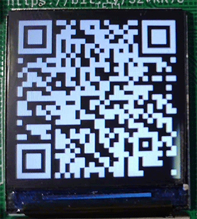
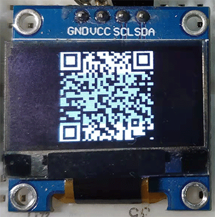

<h1 align="center">MicroPython QRCode CModule</h1>

<p align="center"></p>

### 项目介绍

生成并显示指定内容的二维码

### 添加模块

* 将`ports/esp32/`下的文件复制到`MicroPython`项目对应位置
* 修改`ports/esp32/CMakeLists.txt`文件，增加如下内容：

	```doc
	set(EXTRA_COMPONENT_DIRS $ENV{IDF_PATH}/examples/common_components/qrcode)
	```

* 修改`ports/esp32/main/CMakeLists.txt`文件：

	```doc
	# 在 set(MICROPY_SOURCE_PORT 下边增加
	${PROJECT_DIR}/modqrcode.c

	# 在 set(IDF_COMPONENTS 下边增加
	qrcode

	# 在 idf_component_register( 下的 SRCS、INCLUDE_DIRS 分别增加
	${EXTRA_COMPONENT_DIRS}
	```

* 编译固件即可增加`qrcode`模块

### 显示效果

| 控制台 | TFT | OLED |
| :-: | :-: | :-: |
|  |  |  |

### 简单示例

生成二维码，并在控制台打印输出

```python
>>> import qrcode
>>> _qrcode = qrcode.QRCODE()
>>> _qrcode.ecc_level(qrcode.ECC_HIGH)
>>> _qrcode.generate('https://gitee.com/walkline/micropython-qrcode-cmodule')
I (66945) QRCODE_MODULE: Encoding below text with ECC LVL 3 & QR Code Version 40
I (66945) QRCODE_MODULE: https://gitee.com/walkline/micropython-qrcode-cmodule
>>> print(_qrcode)
<QRCODE version=6, max_version=40 length=41, ecc_level=3, buffer_size=210>
>>> _qrcode.print()
>>>
```

### 更多示例

```bash
# 使用 ab 工具烧录固件
$ ab --flash

# 使用 ab 工具上传相关文件
$ ab

# 使用 ab 工具打开串口
$ ab --repl

# 使用快捷键 ctrl+r，并选择以 demo_ 开头的文件
```

### 模块方法列表

* `qrcode.QRCODE([ecc_level, max_version])`
	* `ecc_level`：容错等级（默认值`ECC_MED`），详情见`模块常量列表`
	* `max_version`：可生成二维码的最大版本号（默认值`VERSION_MAX`），详情见`模块常量列表`
* `ecc_level([level])`：获取或设置容错等级
* `version()`：获取已生成二维码的版本号

	```python
	# 版本号计算方法
	(QRCODE.length() - 17) // 4
	```

* `length()`：获取已生成二维码的边长
* `generate(text)`：使用指定字符串生成二维码
* `print()`：在控制台打印二维码预览图
* `raw_data()`：获取二维码点阵元组数据，形如`((1, 0, ...), (0, 1, ...), ...)`
* `buffer_data(byetarray, format[, scales, color, bg_color])`：将二维码数据以指定格式填充到数组
	* `bytearray`：已初始化大小的`byetarray`数组
	* `format`：数据格式，详情见`模块常量列表`
	* `scales`：放大倍数（默认值`1`）
	* `color`：前景颜色（默认值`1`或`0xffff`）
	* `bg_color`：背景颜色（默认值`0x0000`）

	<br/>

	> **bytearray 初始化长度计算方法：**
	> ```python
	> # FORMAT_MONO_HLSB 格式
	> (QRCODE.length() * scales - 1) // 8 + 1) * (QRCODE.length() * scales)
	>
	> # FORMAT_RGB565 格式
	> (QRCODE.length() * scales) ** 2 * 2
	> ```

### 模块常量列表

* `ECC_LOW`：`7%`容错率，代表二维码内容缺失`7%`后仍可被正确识别，容错率与数据长度成正比，下同
* `ECC_MED`：`15%`容错率
* `ECC_QUART`：`25%`容错率
* `ECC_HIGH`：`30%`容错率

* `VERSION_MIN`：二维码支持的最低版本，`1`
* `VERSION_MAX`：二维码支持的最高版本，`40`

* `FORMAT_MONO_HLSB`：指定`buffer_data()`函数填充数组的方式，适用于`OLED`屏幕
* `FORMAT_RGB565`：指定`buffer_data()`函数填充数组的方式，适用于`TFT`屏幕

### 参考资料

* [QR Code generator component](https://github.com/espressif/esp-idf/tree/master/examples/common_components/qrcode)
* [MicroPython QRCode Research](https://gitee.com/walkline/micropython-qrcode-research)
* [ESP32-C3 MicroPython 固件编译环境搭建教程](https://gitee.com/walkline/esp32-c3_micropython_firmware)
* [WSL 下加速 Github 克隆速度](https://walkline.wang/blog/archives/263)
* [AMPY Batch Tool](https://gitee.com/walkline/a-batch-tool)

### 合作交流

* 联系邮箱：<walkline@163.com>
* QQ 交流群：
	* 走线物联：[163271910](https://jq.qq.com/?_wv=1027&k=xtPoHgwL)
	* 扇贝物联：[31324057](https://jq.qq.com/?_wv=1027&k=yp4FrpWh)

<p align="center"></p>
